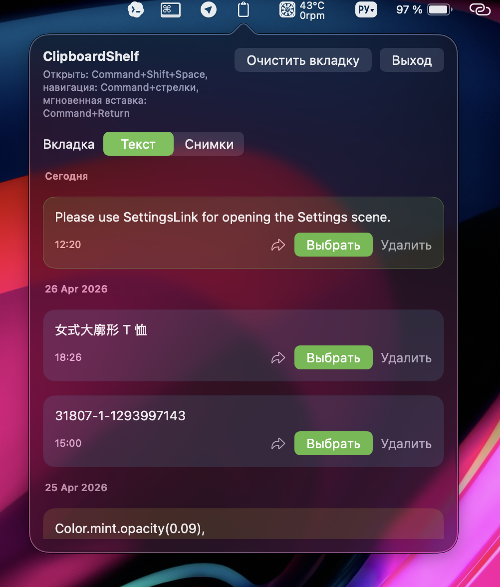
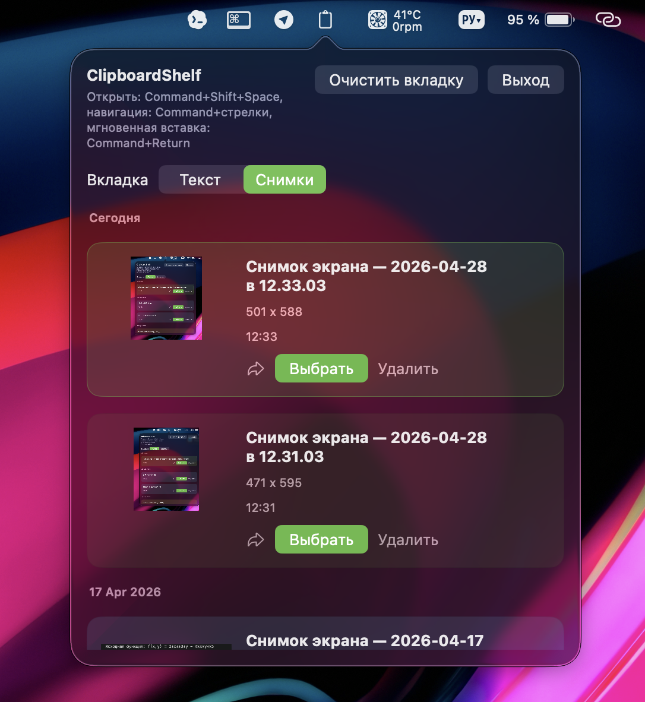
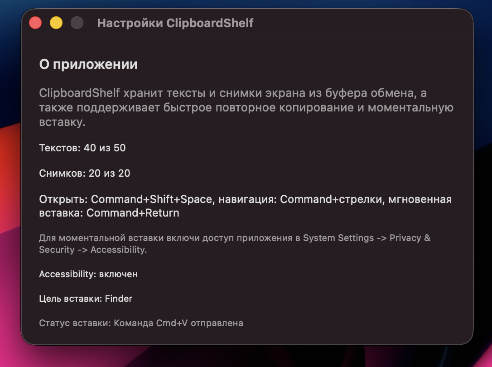

# ClipboardShelf

Надоело постоянно возвращаться к ранее скопированным фрагментам текста из разных окон и частей документа? Есть решение:

`ClipboardShelf` — это простое macOS-приложение в строке меню, которое сохраняет историю скопированного текста и снимков экрана, а затем позволяет быстро выбрать нужный элемент и снова использовать его.





## Возможности

- хранит историю последних текстов;
- хранит историю снимков экрана;
- разделяет текст и снимки по отдельным вкладкам;
- группирует элементы по дням;
- показывает актуальные названия скриншотов, включая переименованные на рабочем столе;
- позволяет заново скопировать нужный элемент;
- поддерживает мгновенную вставку в приложения;
- поддерживает удобную навигацию с клавиатуры;
- работает из строки меню macOS.

## Горячие клавиши

- `Command + Shift + Space` — открыть или скрыть приложение
- `Command + Up / Down` — выбрать предыдущий или следующий элемент
- `Command + Left / Right` — переключить вкладку
- `Command + Return` — мгновенно вставить выбранный элемент
- `Command + Shift + V` — альтернативная горячая клавиша мгновенной вставки

## Установка для пользователя

1. Скачай архив `ClipboardShelf-macOS.zip` со страницы `Releases`.
2. Распакуй архив.
3. Перенеси `ClipboardShelf.app` в папку `Applications`.
4. Запусти приложение.
5. Для мгновенной вставки включи доступ в:
   `System Settings -> Privacy & Security -> Accessibility`

## Важное замечание

Если пользователь скачает репозиторий через `Code -> Download ZIP`, он получит исходный код проекта, а не готовое приложение.

Для установки нужно скачивать именно архив с приложением со страницы `GitHub Releases`!

## Как открыть проект в Xcode

1. Установи полный `Xcode`.
2. Открой файл `ClipboardShelf.xcodeproj`.
3. Выбери target `ClipboardShelf`.
4. Нажми `Run`.

## Как собрать `.app` без Xcode

В проекте есть установочный скрипт:

```bash
"./Scripts/install_app.sh"
```

Он:
- собирает приложение;
- копирует `ClipboardShelf.app` в `~/Applications`.


## Стек

- `Swift`
- `SwiftUI`
- `AppKit`
- `Accessibility API`
- `NSPasteboard`

## Лицензия
Проект опубликован по лицензии MIT.
Это означает, что код можно свободно использовать, изменять и распространять с сохранением текста лицензии.
Подробности см. в файле LICENSE.
